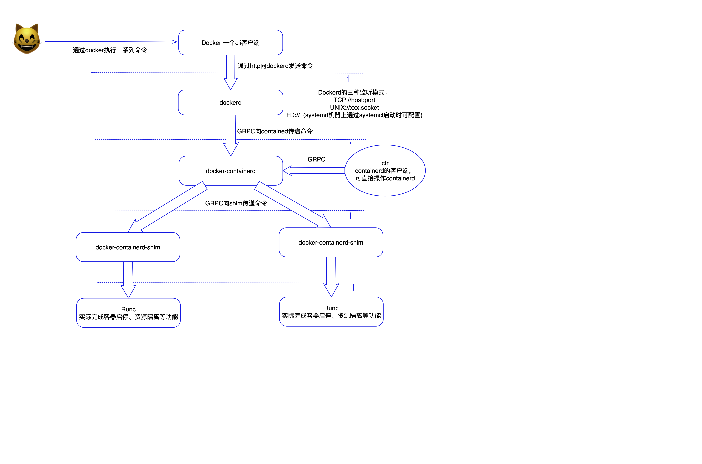

# docker整体结构分析
1. 整体示意图如下： 

2. 功能解释：  
+ docker：整个架构体系对用户暴露的客户端，可通过其与dockerd进行通信。  
+ dockerd: Docker守护程序本身。列表中最高级封装的组件。提供Docker的所有出色的交互功能，dockerd启动时会去创建docker-containerd子进程。
    其支持三种监听方式，且可以执行多个监听动作：
    1. tcp，如tcp://127.0.0.1:9000
    2. unix,默认为该方式/var/run/docker.sock
    3. fd,仅在systemd启动方式下可用，docker会判断如果是fd，则期望由父进程传递进来套接字，而不是由自己创建。systemctl start 时可以完成这个动作(启动文件中有标记：Requires=docker.socket)
+ docker-containerd: 也是一个守护程序，对外提供GRPC接口。本身不依赖dockerd(但是dockerd依赖containerd)它是真正管控容器的守护进程,可以拥有多个shim子进程实例。 
+ docker-containerd-ctr: containerd的客户端，类似于docker与dockerd之间的关系。
+ docker-containerd-shim: 
    1. 允许runC实际运行容器之后退出，避免多个runc占用太大内存（但是shim本身也占有不小内存，参考[stackoverflow question](https://stackoverflow.com/questions/58297598/docker-containerd-shim-cost-too-much-memory)）。此时将由shim接管成为容器的父进程。
    2. shim是位于容器和Runc之间的组件，高效的将containerd和runc解耦，并且主动收集报告容器的状态。
+ runc: 实际运行容器的满足OCI协议标准的组件。这是一个剥离化的产物，创建容器，其实最终通过runc就可以了。可通过下载github.com/opencontainers/runc源码编译安装
    ```
  用runc创建一个容器：
  mkdir -p mycontainer/rootfs
  cd mycontainer/
  docker export $(docker create busybox) | tar -C rootfs -xf -
  ls
  runc spec
  sudo runc run mycontainer
  默认情况下，runc是要root用户才能执行的.
  对比了一下执行 runc spec 和 runc spec --rootless 生成的 config.json:区别是 runc spec 生成的 config.json 默认会挂载 /sys 下的东西，此外使用了user这个命名空间把容器里的root用户和容器外的非root用户对应起来：
  ```
  
**参考**：  
[stackoverflow question](https://stackoverflow.com/questions/46649592/dockerd-vs-docker-containerd-vs-docker-runc-vs-docker-containerd-ctr-vs-docker-c)  
[Docker组件介绍（一）：runc和containerd](https://jiajunhuang.com/articles/2018_12_22-docker_components.md.html)
